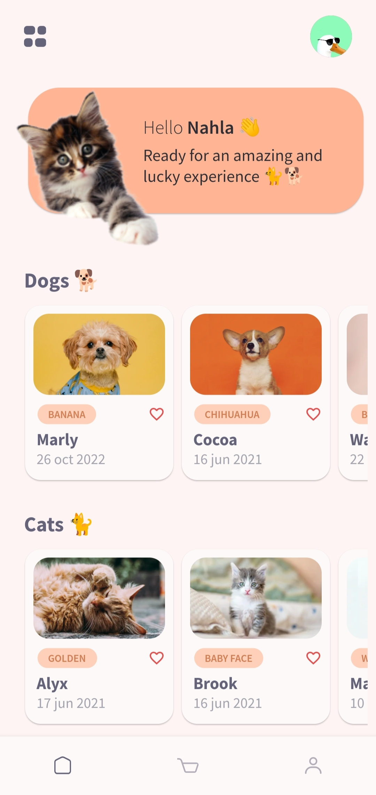

# Pet Shop

A new Flutter project. Implementation of LuckyPet E-Commerce mobile app designed by <a href="https://dribbble.com/shots/16306013-Freebie-LuckyPet-E-Commerce-Mobile-App">Osama Dawood</a> from <a href="https://dribbble.com">Dribbble</a>.

## Design by
<a href="https://dribbble.com/shots/16306013-Freebie-LuckyPet-E-Commerce-Mobile-App">Osama Dawood</a>

## Used packages
-<a href="https://pub.dev/packages/google_fonts">google_fonts</a> :- version ^4.0.4

-<a href="https://pub.dev/packages/flutter_svg">flutter_svg</a> :- version ^1.1.6

-<a href="https://pub.dev/packages/cupertino_icons">cupertino_icons</a> :- version ^1.0.2

## Screenshots

